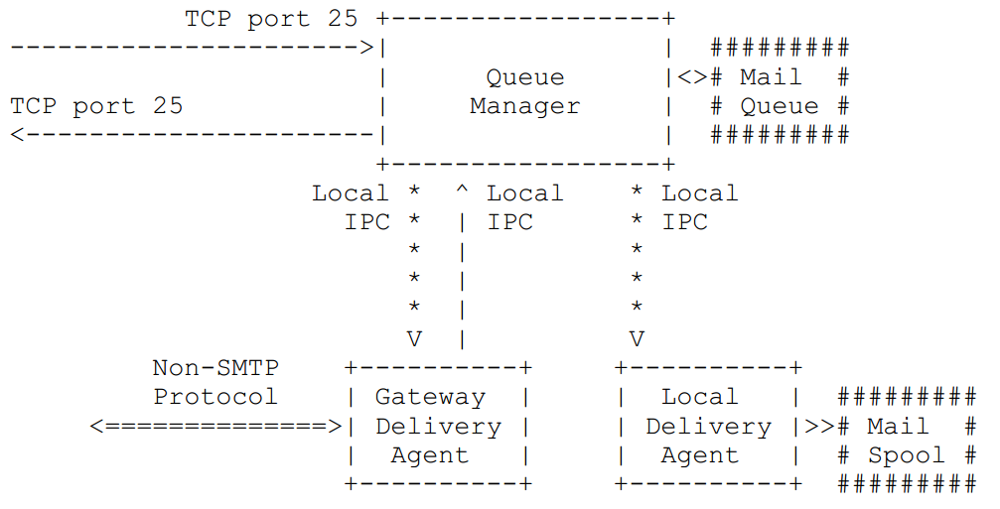

## 本地邮件传输协议（Local Mail Transfer Protocol LMTP）

### Abstract

SMTP和SMTP服务扩展（ESMTP）提供了一种高效安全传送电子邮件的方法，**SMTP协议**的设计要求服务器**管理邮件传送队列**。

在有些时候这样做可能有麻烦，需要**一种没有队列的邮件传送系统**，而**LMTP就是这样的一个系统**。

尽管LMTP是ESMTP的替代协议，但它使用（几乎没有变化）ESMTP的语法和语义。这个设计允许LMTP使用为ESMTP定义的扩展。

LMTP也不能用于TCP端口25。

### Introduction and Overview

SMTP的这种队列机制在最初设计时是为了考虑到转发的需要，
但在有些时候，并不需要服务器管理这个队列，而需要由客户进行队列的管理，我们看一下下面这个例子：



上图中有三个独立的通信系统，三个方框内的就是。

- 第一个是队列管理器，它是一个传统的SMTP代理，通过TCP与其他主机之间传递消息，并管理一个持久化的邮件队列。
- 第二个是使用非SMTP协议的代理，与其他邮件系统通信的网关。
- 第三个是将邮件放入到一个持久化的邮件池的系统。

可能用户希望**将SMTP用于本地进程内通信通道**，从队列管理器到传送代理间传送信息。
但是，这将显着**增加传送代理（Delivery Agents）的复杂性**，因为**需要传送代理管理它们自己的邮件队列**。

用信封地址（es）作为命令行参数调用一个传送代理，然后**传送代理返回退出码的通用做法有三个严重的问题**：
代理**只能返回一个退出代码**以应用于所有收件人，扩展接口来处理ESMTP扩展是很困难的，如DSN [DSN]和ENHANCEDSTATUSCODES [ENHANCEDSTATUSCODES]，以及由于临时条件，由系统库执行退出经常被解释为永久性错误。

**LMTP协议**让服务器在**DATA命令最后的`.`**之后返回，每个收件人一个回复。
因此，如果队列管理器配置为使用LMTP而不是SMTP时将消息传递给传送代理，
然后传送代理可能会在最后的`.`后尝试传递给每个收件人和分别报告每个收件人的状态。

哪个应该**使用LMTP协议的链接**在上图中绘制使用**星号**。

>将邮件从本地传输代理传向队列管理器时使用LMTP不会有什么好处，
但是在队列管理器传送邮件到本地传输代理时使用LMTP却十分有好处，
因为这样接收者的邮件分别发送，而一封信件可以得到多个应答，这个应答指示相应的邮件是不是正确发送到接收者了。

>队列管理器实现了一个邮件队列，所以可以存储消息并在以后承担传送责任。

## The LMTP protocol

LMTP协议与SMTP和ESMTP协议很像，除了本文内说明的一些命令改变外，其它和SMTP都一样。

一个**成功的RCPT命令**被定义为**返回确认完成应答码的RCPT命令**。请注意：一般的成功命令都以2开头。

### 1. The LHLO, HELO and EHLO commands

为了避免和SMTP和ESMTP服务混淆，LMTP使用LHLO命令开始一个LMTP会话，
它的基本语法和HELO和EHLO命令相同。

LMTP中不存在ESMTP的`HELO`和`EHLO`命令。LMTP服务器对于这两个命令不能返回一个确认完成应答码。建议返回500。

### 2. The DATA command

在LMTP协议中，DATA命令有一个**额外的限制**，还有一个关于**如何回复最后的`.`**的更改。

额外的限制是，当在**邮件事务中没有成功的RCPT命令**，**DATA命令必须返回503，并失败**。

更改是**DATA命令最后的`.`之后**，服务器**按照RCPT命令的发出顺序**，对邮件事务中的**每个先前成功的RCPT命令返回一个应答**。
即使对于同一个转发路径来说有许多RCPT命令，也必须返回多个成功应答。

当**其中一个对最后的`.`的应答是确认完成应答**，服务器正在接受**将消息传递或转发给相应收件人的责任**。
它必须认真对待这个责任，也就是说，不能因为不重要的原因而丢失信息，例如，因为主机后来崩溃，或者由于可预见的资源短缺。

多行回复仍被视为单个回复，并对应于单个RCPT命令。//TODO

```text
S: 220 foo.edu LMTP server ready
C: LHLO foo.edu
S: 250-foo.edu
S: 250-PIPELINING
S: 250 SIZE
C: MAIL FROM:<chris@bar.com>
S: 250 OK
C: RCPT TO:<pat@foo.edu>
S: 250 OK
C: RCPT TO:<jones@foo.edu>
S: 550 No such user here
C: RCPT TO:<green@foo.edu>
S: 250 OK
C: DATA
S: 354 Start mail input; end with <CRLF>.<CRLF>
C: Blah blah blah...
C: ...etc. etc. etc.
C: .
S: 250 OK
S: 452 <green@foo.edu> is temporarily over quota
C: QUIT
S: 221 foo.edu closing connection
```

请注意：上面例子中的服务器和客户的域名是相同的，这是因为服务器和客户是同一个邮件系统的不同子系统。
这里只介绍对于SMTP服务的相应内容，对于ESMPT的内容请参阅其它资料。

### 3. The BDAT command

如果服务器支持ESMTP CHUNKING扩展[BINARYMIME]，则**包含LAST参数的BDAT命令**会**按照RCPT命令发出的顺序**，为邮件事务中**每个先前成功的RCPT命令返回一个答复**。
即使有多个成功的RCPT命令给出相同的转发路径，每个成功的RCPT命令也必须有一个应答。
如果邮件事务中没有以前成功的RCPT命令，则BDAT LAST命令将不返回答复。

当其中一个对BDAT LAST命令的应答是确认完成应答时，服务器正在接受将消息传递或转发给相应收件人的责任。
它必须认真对待这个责任，也就是说，不能因为不重要的原因而丢失信息，例如，因为主机后来崩溃，或者由于可预见的资源短缺。

多行回复仍被视为单个回复，并对应于单个RCPT命令。//TODO

没有LAST参数的BDAT命令的行为不会改变; 他们仍然只返回一个答复。//TODO

## Implementation requirements

由于LMTP是与SMTP不同的协议，因此它不能用于TCP服务端口25。

服务器实现必须实现PIPELINING [PIPELINING]和ENHANCEDSTATUSCODES [ENHANCEDSTATUSCODES] ESMTP扩展。//TODO
服务器实现应该实现8BITMIME [8BITMIME]扩展。// TODO

使用LMTP会加剧[DUP-MSGS]中描述的情况。
为了避免这种同步问题，需要满足以下要求：

能够快速接受将消息传送或转发给多个接收者并且能够发送任何必要的通知消息的服务器实现不应当实现LMTP协议。

LMTP协议**不应该在广域网上使用**。

**服务器**应该**尽快发送每个回复**。如果要为下一个收件人**花费一笔不小的时间**处理**传送**，则应该**刷新任何传出的LMTP缓冲区**，**以便客户可以迅速收到回复**。

客户端必须**在应答到达时处理**，而**不要在所有应答均到达时才处理**，如果链接在收到一些（但不是全部）收件人的回复后关闭，则客户端必须处理到达的回复，并将剩余的回复视为临时故障。